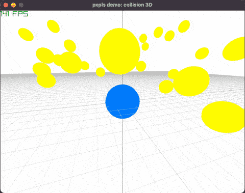

# Pxpls
A simple physics engine supports 2D and 3D collision detection and simulation.


# Install
## Download
```
git clone https://github.com/Ninter6/pxpls.git
cd pxpls
```
## Build library only
```
cmake -S . -B build -DCMAKE_BUILD_TYPE=Release
cmake --build build -j8
```
## Build demo
```
cmake -S . -B build -DCMAKE_BUILD_TYPE=Release -DPXPLS_BUILD_DEMO=on
cmake --build build -j8
```
